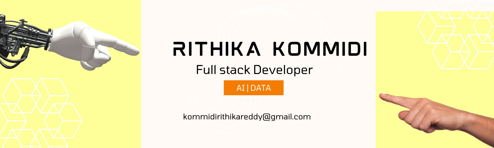

# 👋 Hey there, I'm Rithika!  

I'm a Full Stack Developer, UI/UX Designer, Data Enthusiast, and AI Explorer 🚀. I love building things that solve real-world problems and make life easier—or at least more fun!  

---

## 🎯 What I Do
- Build **responsive, scalable web apps** using React, Angular, Node.js, and Django  
- Explore **AI/ML** to create smarter applications (LLMs, NLP, Predictive Models)  
- Design **data-driven dashboards** with Power BI, Tableau, and Python visualizations  
- Deploy and maintain apps on **Azure Cloud** with CI/CD pipelines  

---

## 🔧 My Toolbox

```javascript
const rithika = {
  languages: ["Java", "Python", "JavaScript", "TypeScript", "SQL"],
  frontend: ["React", "Angular", "HTML", "CSS", "Bootstrap", "Figma"],
  backend: ["Node.js", "Express.js", "Django", "REST APIs", "Microservices", "Redis"],
  databases: ["MySQL", "PostgreSQL", "MongoDB", "NoSQL"],
  cloudDevOps: ["Azure", "Docker", "CI/CD", "GitHub Actions", "Azure DevOps"],
  aiAndData: ["Scikit-learn", "NLP", "Prompt Engineering", "Power BI", "Tableau"]
};

```
---

## 🚀 Projects I’m Proud Of
- **LLM Verification & Validation** – Tested and improved large language models like ChatGPT, Bard AI, Llama
  
- **Pharmacy Management System** – Full-stack web app to manage inventory, billing, and customers
  
- **Cybercrime Prevention** – Java + ML project to detect and prevent anomalies in cybersecurity
  
- **Music Streamer** – Node.js + MongoDB backend for managing multiple users and streaming data  

---

## 🧩 Fun Facts
- I debug like it’s a puzzle 🧩
- I enjoy turning complex problems into clean UIs
- Music + coding = perfect focus 🎧

---

## 🌐 Let’s Connect!
I’m always open to collaborating on fun projects, sharing knowledge, or just geeking out over tech!  

📫 Email: [kommidirithikareddy@gmail.com](mailto:kommidirithikareddy@gmail.com)  

🔗 LinkedIn: [Rithika Reddy Kommidi](https://www.linkedin.com/in/r-analyst/)  

🌐 Portfolio: [coming soon](#)  

---

## 💬 Thought of the Moment

> “Progress comes from curiosity and consistency.” 

---

Thanks for visiting — let’s keep building, learning, and growing.💻
